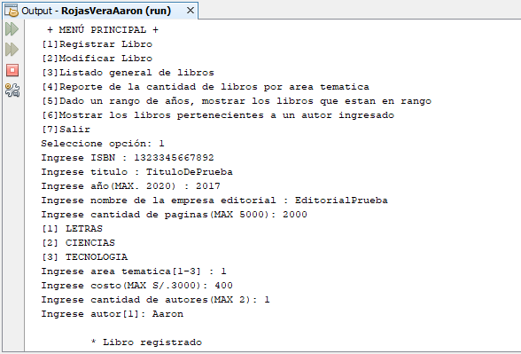

# Sistema de libreria
Sistema sobre una Librería donde se puede registrar un libro, modificar un libro, listar los libros, mostrar la cantidad de libros por área temática, mostrar los libros que están en un rango de años y mostrar los libros pertenecientes a un autor ingresado, **15/01/20**.

<strong>Imagen:</strong> Menú principal - Registrar libro.

